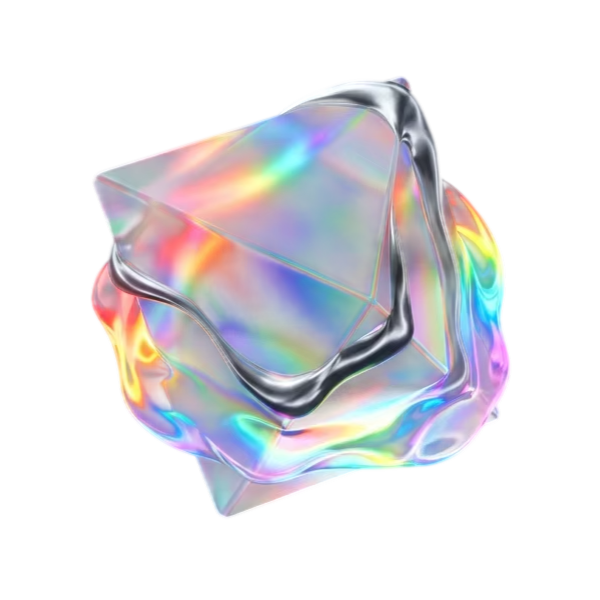
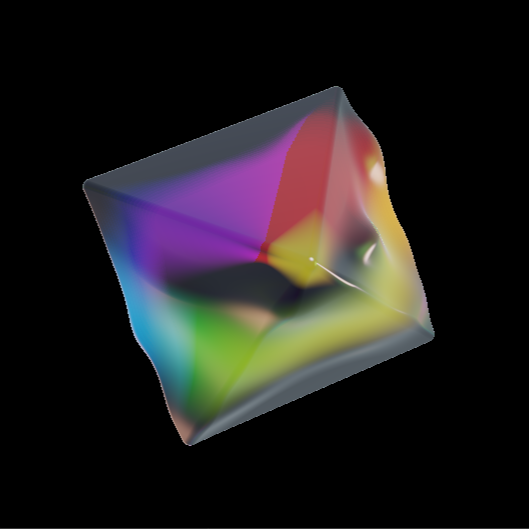

# PrismQ

홀로그래픽 이리데센트 3D 오브젝트 WebGL 렌더러.  
Three.js 기반 GLSL 레이마칭으로 정팔면체와 유기적 blob이 결합된 SDF를 실시간 렌더링합니다.

| 레퍼런스 이미지 | 렌더링 이미지 |
|:---:|:---:|
|  |  |

---

## 개요

PrismQ는 단일 HTML 파일(`PrismQ.html`)로 동작하는 자립형 WebGL 렌더러입니다.  
외부 빌드 툴이나 프레임워크 없이 브라우저에서 직접 실행되며, `<iframe>`을 통해 Flutter Web 등 외부 프레임워크에 임베딩할 수 있습니다.

**주요 특징**

- Raymarched SDF: 정팔면체 + blob 유기체 결합
- 홀로그래픽 이리데선스: 시점각 기반 무지개 색상 변화
- 분산 스펙트럼 굴절: Cauchy 분산 계수 기반 프리즘 효과
- 디바이스 적응형 렌더링: 모바일/데스크탑 품질 자동 분기
- 접근성 지원: `prefers-reduced-motion` 정적 이미지 fallback

---

## 기술 스택

| 항목 | 내용 |
|---|---|
| 렌더러 | Three.js r128 (CDN) |
| 셰이딩 | GLSL ES (WebGL 1.0 호환) |
| 지오메트리 | Three.js `IcosahedronGeometry` (Three.js hull, SDF는 fragment에서 독립 계산) |
| SDF 알고리즘 | Raymarching — sphere tracing |
| 조명 모델 | GGX/Smith BRDF + Fresnel (Schlick) |
| 노이즈 | 3D Simplex Noise |

---

## 코드 구조

```
PrismQ.html
├── <style>
│   ├── CSS 변수 --bg-color (JS에서 주입, 로드 전 깜빡임 방지)
│   └── #rm-fallback (prefers-reduced-motion 전용 이미지)
│
├── <script> [1] prefers-reduced-motion 감지
│   └── OS "동작 줄이기" 설정 시 fallback 이미지 표시 후 렌더러 초기화 생략
│
├── <script src="three.min.js"> Three.js CDN 로드
│
└── <script> [2] 메인 렌더러 (prefersReducedMotion=false 시만 실행)
    │
    ├── SCENE SETUP
    │   ├── 디바이스 감지 (isMobile)
    │   ├── DPR / FPS 캡 / AntiAlias 분기
    │   ├── PerspectiveCamera (fov=28°, z=5.7)
    │   └── WebGLRenderer 초기화
    │
    ├── FPS 모니터링
    │   └── 1초 슬라이딩 윈도우 → console.debug('[PrismQ] avg FPS: ...')
    │
    ├── LIGHTING — 구면좌표 4광원 배치
    │   ├── lPos[0]: 상단 우측 앞 (페일 민트, 주광)
    │   ├── lPos[1]: 중간 좌측 뒤 (레드 보조광)
    │   ├── lPos[2]: 중간 정면   (그린 보조광)
    │   └── lPos[3]: 하단 뒤    (블루, 미사용 — GGX/env 전용)
    │
    ├── ShaderMaterial (CustomBlending — Premultiplied Alpha)
    │   ├── VERTEX SHADER
    │   │   └── 오브젝트 공간 position·카메라 위치 → fragment로 전달
    │   └── FRAGMENT SHADER
    │       ├── [1] 3D Simplex Noise
    │       ├── [2] SDF 프리미티브 (_octa, _smin, rotX/Y)
    │       ├── [3] SDF 씬 컴포지션 (정팔면체 + blob smooth union)
    │       ├── [4] Raymarching (sphere tracing, 80 primary steps)
    │       ├── [5] 표면 법선 계산 (tetrahedron finite difference)
    │       ├── [6] GGX/Smith BRDF + Fresnel 조명
    │       ├── [7] 홀로그래픽 이리데선스
    │       ├── [8] 분산 스펙트럼 굴절 (2nd hit, 24 steps, 8 wavelength samples)
    │       ├── [9] 블롭 자발광 (semi-emissive)
    │       └── [10] 토네맵 + 감마 보정 (최종 출력)
    │
    ├── IcosahedronGeometry + Mesh 생성
    │
    └── RENDER LOOP
        ├── requestAnimationFrame
        ├── FPS 캡 적용 (delta < FPS_INTERVAL → skip)
        ├── uTime / uMatWorldInv / uModelMat / uNormalMat 매 프레임 갱신
        └── resize 핸들러 (camera.aspect / renderer.setSize / uResolution 갱신)
```

---

## 확정 파라미터

아래 파라미터는 시각적 결과물 기준으로 확정된 값입니다. 임의 수정 시 의도한 결과물과 달라질 수 있습니다.

### SDF 형태

| 파라미터 | 값 | 설명 |
|---|---|---|
| octahedron `s` | `1.0` | 정팔면체 꼭짓점 거리 |
| bevel | `0.01` | 정팔면체 모서리 베벨 반경 |
| blob radius | `0.72` | blob 기저 쉘 두께 |
| noise frequency | `2.5` | Simplex noise 공간 주파수 |
| domain warp | `0.1` | noise 도메인 뒤틀림 강도 |
| displacement amplitude | `0.25` | blob 표면 요철 진폭 |
| smin k | `0.1` | smooth union 블렌딩 반경 |

### 카메라

| 파라미터 | 값 |
|---|---|
| fov | `28°` |
| camera.z | `5.7` |
| near / far | `0.1 / 100` |

### 머티리얼

| uniform | 값 | 설명 |
|---|---|---|
| `uTransp` | `0.35` | 투명도 혼합 비율 |
| `uRoughness` | `0.65` | 표면 거칠기 |
| `uSemiEmissStr` | `1.2` | 블롭 자발광 강도 |
| `uIridStr` | `1.2` | 이리데선스 강도 |
| `uIridExp` | `3.5` | 이리데선스 분포 지수 |
| `uPrismStr` | `10.0` | 분산 스펙트럼 배율 |
| `uPrismDisp` | `0.013` | Cauchy 분산 계수 |

### 애니메이션

| 파라미터 | 값 |
|---|---|
| rotX 속도 | `uTime × 0.18` |
| rotY 속도 | `-uTime × 0.32` |

### 렌더링 품질

| 항목 | 모바일 | 데스크탑 |
|---|---|---|
| Target DPR | `0.5` | `min(devicePixelRatio, 1.5)` |
| FPS 캡 | `30` | `60` |
| AntiAlias | 비활성 | 활성 |
| Primary raymarch steps | 80 | 80 |
| 2nd hit steps | 24 | 24 |
| Wavelength samples | 8 | 8 |

---

## 배경색 변경

배경색은 `BG_COLOR` 상수 한 곳에서 관리됩니다.

```javascript
const BG_COLOR = '#000000';  // ← 이 한 곳만 수정
```

변경 시 WebGL clearColor, CSS `--bg-color`, `document.body.style.background` 세 곳에 자동으로 전파됩니다.

---

## 접근성

OS의 "동작 줄이기(Reduce Motion)" 설정이 활성화된 경우 Three.js 렌더러 초기화를 전면 생략하고 정적 이미지(`PrismQ-Photoroom_test.png`)를 표시합니다.

근거: WCAG 2.1 §2.3.3 — 전정기관 장애 사용자 보호

---

## 성능 모니터링

렌더 중 Chrome DevTools Console의 **Verbose** 레벨을 활성화하면 1초 간격으로 평균 FPS가 출력됩니다.

```
[PrismQ] avg FPS: 60.0
[PrismQ] avg FPS: 59.7
```

---

## iframe 임베딩

`PrismQ.html`은 `<iframe>`으로 외부 페이지에 임베딩할 수 있습니다.  
`window.innerWidth / innerHeight`가 iframe 내부 뷰포트 크기를 자동 참조하므로 별도 크기 설정 없이 컨테이너에 맞게 렌더링됩니다.

```html
<iframe
  src="PrismQ.html"
  width="520"
  height="520"
  style="border:none; pointer-events:none;"
  sandbox="allow-scripts allow-same-origin">
</iframe>
```

**Flutter Web (dart:ui_web)**

```dart
IFrameElement()
  ..src = 'PrismQ.html'
  ..style.width = '520px'
  ..style.height = '520px'
  ..style.border = 'none'
  ..style.pointerEvents = 'none'
  ..setAttribute('sandbox', 'allow-scripts allow-same-origin')
```

---

## 파일 구성

```
web/
├── PrismQ.html                  # 메인 렌더러
├── PrismQ-Photoroom.png         # 레퍼런스 이미지
└── PrismQ-Photoroom_test.png    # prefers-reduced-motion fallback 이미지
```

---

## 의존성

| 라이브러리 | 버전 | 로드 방식 |
|---|---|---|
| Three.js | r128 | cdnjs CDN |

오프라인 환경에서는 Three.js CDN 로드 실패로 렌더러가 동작하지 않습니다.  
이 경우 `prefers-reduced-motion` fallback과 동일하게 정적 이미지를 별도 처리하는 것을 권장합니다.